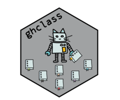

# ghclass 

<!-- badges: start -->
[](https://github.com/rundel/ghclass/actions?query=workflow%3AR-CMD-check)
[](https://github.com/rundel/ghclass/actions/workflows/R-CMD-check.yaml)
<!-- badges: end -->

## Tools for managing GitHub class organization accounts

This R package is designed to enable instructors to efficiently manage their courses on GitHub. It has a wide range of functionality for managing organizations, teams, repositories, and users on GitHub and helps automate most of the tedious and repetitive tasks around creating and distributing assignments.

Install ghclass from CRAN:

```r
install.packages("ghclass")
```

Install the development version package from GitHub:

``` r
# install.packages("remotes")
remotes::install_github("rundel/ghclass")
```

See package [vignette](https://rundel.github.io/ghclass/articles/articles/ghclass.html) for details on how to use the package.


## Peer Review

In order to speed up the process of getting this package submitted to CRAN we have decided to move the peer review functionality to the `peer_review` branch for the time being. This functionality will be included in the CRAN release as soon as possible, hopefully in the next, v0.2.1, release. If you were using this functionality and need access to a version of ghclass with it then you can install this branch using:

``` r
remotes::install_github("rundel/ghclass@peer_review")
```

## GitHub & default branches

Recently, GitHub has announced that they will be changing the default branch for all new repositories on their platform to `main` from `master`. Details on this change and the timeline for implementation are available [here](https://github.com/github/renaming). In anticipation of these changes we have updated `ghclass` to support alternative default branch names across the entire package. See the FAQ in the Getting Started vignette for more details.
