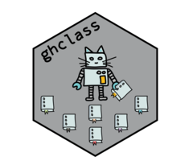

# ghclass 

<!-- badges: start -->
[](https://github.com/rundel/ghclass/actions/workflows/R-CMD-check.yaml)
[](https://CRAN.R-project.org/package=ghclass)
<!-- badges: end -->

## Tools for managing GitHub class organization accounts

This R package is designed to enable instructors to efficiently manage
their courses on GitHub. It has a wide range of functionality for
managing organizations, teams, repositories, and users on GitHub and
helps automate most of the tedious and repetitive tasks around creating
and distributing assignments.

Install ghclass from CRAN:

``` r
install.packages("ghclass")
```

Install the development version package from GitHub:

``` r
# install.packages("remotes")
remotes::install_github("rundel/ghclass")
```

See package
[vignette](https://rundel.github.io/ghclass/articles/ghclass.html)
for details on how to use the package.

## Peer Review

The peer review functionality currently lives on the `peer_review` branch
and is not part of the CRAN release. If you need it you can install that
branch using:

``` r
remotes::install_github("rundel/ghclass@peer_review")
```

## GitHub & default branches

GitHub now uses `main` as the default branch for new repositories (see
[here](https://github.com/github/renaming) for background). `ghclass`
supports alternative default branch names across the entire package, so
for the vast majority of use cases you will not need to do anything
differently. See the FAQ in the Getting Started vignette for more details.
