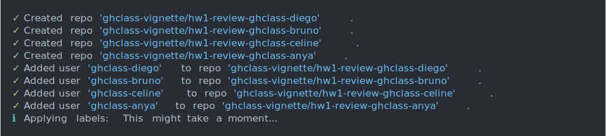

This vignette introduces the peer review functionality of `ghclass` and provides a step-by-step guide.
For more information on the pedagogy of peer review in undergraduate courses, see the draft of the [accompanying paper](https://github.com/thereseanders/cprpaper/blob/master/cetinkayarundelanders_cpr.pdf) by the package authors.

# Before peer review

The peer review process is initiated after a regular assignment has been distributed to students.
Below, we run through a quick example of how to set up a fictional assignment "hw2" for four students using the `create_repo()` function.
For a more detailed description of how to set up student repositories in a GitHub Organization,  see the `ghclass` ["Get started" vignette](https://rundel.github.io/ghclass/articles/ghclass.html).


```asciicast
students = c("ghclass-anya", "ghclass-bruno", "ghclass-celine", "ghclass-diego")
repos = paste0("hw1-", students)

org_create_assignment("ghclass-vignette", repo = repos, user = students,
                      source_repo = "Sta323-Sp19/hw1")
```


# Step-by-step guide to peer review

The peer review process with `ghclass` has three stages.

1. **Initiation**: Create an assignment-specific roster and review repos for all students.
2. **Assign review**: Create and customize review forms, distribute review forms and authors' assignments to reviewers, students complete review.
3. **Return review & rating**: Create rating form, return review to authors, optional: students rate reviews.


## Initiation

### Create a roster of author-reviewer assignments

Instructors have two options for pairing authors with reviewers.
You may provide a custom peer review roster or use the `peer_roster_create()` function to have a random assignment roster automatically created for you.[^1]

[^1]: A custom user-generated peer review roster should follow the format of the roster generated by `peer_roster_create()` to be correctly processed. It should contain a column `user` to capture GitHub user names, `user_random` for anonymized user IDs, and a `rev*` column for each reviewer that is assigned to review the user's work.

The `peer_roster_create()` function generates data frame of random author-reviewer assignments.
The parameter `n_rev` specifies the number of reviewers per assignment.
Instructors should choose the number of reviewers per assignment carefully, as each additional review will significantly increase the time investment for students and the calls that have to be made to the API in the review process.

The function automatically randomizes the order in which students are assigned to review their peers' work.
A seed is set to make the assignment of authors to reviewers reproducible. If the function default of `write_csv = TRUE` is selected, the function writes the roster to a .csv file.
We recommend for instructors to set `write_csv = TRUE` and the seed that was used to create the roster is automatically incorporated into the file name of the output. This ensures reproducibility of the random assignment.

The roster file will contain the following columns:
- `user` lists students' GitHub user names
- `user_random` randomizes the order of user names and gives each user an anonymous ID, using the pattern `aut*`.
- The `rev*` column(s) specify the randomized user ID of the student(s) that are assigned to review the user's assignment.

We recommend for instructors to create a new roster file (with a new random seed) for each assignment to prevent the same pairings of students reviewing each others work over and over throughout the course. For the purpose of demonstration, below we save the roster in a data frame called `roster_test`.


```asciicast
roster = peer_roster_create(n_rev = 2, user = students, seed = 123, write_csv = FALSE)
roster
```


### Create review repositories

The `peer_init()` function initiates peer review repositories for each user. This is done to ensure that authors' assignments do not permanently live on the repositories in which reviewers created their assignment.
`peer_init()` creates a review repository for each user, adds users to the respective repositories, and applies peer review labels to all repositories (i.e. assignment and review repositories).
The repositories are identified via the tag "-review" being automatically added to the instructor-specified `prefix` or `suffix` parameters.


```asciicast
peer_init(org = "ghclass-vignette", roster = roster, prefix = "hw1-")
```




## Assign reviewers

### Create and customize feedback form for reviewers

Instructors can use the `peer_form_create_review()` function to create a blank feedback form and save it as an RMarkdown (`.Rmd`) file.[^2]
Instructors can specify the number of questions to be included in the blank form.
The function automatically creates `q*_score` parameters for each question in the YAML header of the RMarkdown document.
Students are extracted to use these `q*_score` fields in the YAML to record the scores they give authors for their assignement.
These YAML parameters are later used to extract and save student scores.

[^2]: Alternatively, you can access a reviewer feedback form template via `File` > `New File` > `R Markdown` > `From Template` > `Reviewer feedback form` after installing and loading the `ghclass` package.

By default, the files contain an `author` field in the YAML header to prompt reviewers to identify themselves.
Keeping reviewers non-anonymous (as opposed to authors) is likely to discourage overly harsh or rude reviews.
If reviewers should instead stay anonymous, setting `double_blind = TRUE` will remove this field.


```asciicast
peer_form_create_review(n = 2, double_blind = TRUE, fname = "feedback_blank_review")
```


The blank form is saved in the working directory, unless otherwise specified. The instructor can then customize the questions to be answered by reviewers.

### Move author files to reviewers

The `peer_assign()` function distributes review assignment to reviewers.
It grabs designated files on the authors' repositories and clones them into the author-specific folder on reviewers' repositories, based on the roster.
Author-specific folders are identified with each author's anonymous author ID contained in the `user_random` column of the roster.
If a file path to a review form is specified in `local_path_review`, the form will be added to reviewers' review repositories.

If no `path` is specified within `peer_assign()`, all files on authors' repositories will be moved to their folder on the review repositories.
By default, files with the following extensions will not be moved if no `path` is specified: `c(".gitignore", ".Rhistory", "*.Rproj", "*.html", "*.md", "*.pdf")`.
Users may customize the file extensions to be excluded via the `exclude_pattern` parameter.

`peer_assign()` will open an issue in the reviewers' repositories that contains links to the relevant review files.
You may instruct students to close the issue to signal that they completed the assignment.

<!-- TODO - fix from here on -->


```r
peer_assign(
  org = "ghclass-vignette",
  roster = roster,
  prefix = "hw1-",
  local_path_review = "feedback_blank_review.Rmd"
)
```

To ensure that the process of moving files from authors' to reviewers' repositores runs smoothly and author anonymity is maintained, students should be asked to not change file names and to not add identifying information such as name, student ID, or email addresses to their assignments.

## Return review & rating

### Collect scores given by reviewers

`peer_score_review()` collects the scores given by reviewers to authors.
We recommend keeping the default setting of `write_csv = TRUE` to save the output as a `.csv` file in the working directory.


```r
peer_score_review(
  org = "ghclass-vignette",
  roster = roster_test,
  prefix = prefix,
  form_review = "hw2_review.Rmd",
  write_csv = TRUE
)
```

### [Recommended] Create rating form for authors

The `peer_form_create_rating()` can be used to create a blank RMarkdown form used to collect authors' feedback on the reviews.[^3]
Three rating categories are included in the file by default:[^4]

1. `helpfulness`: The reviewer's feedback was constructive and helpful.
2. `accuracy`: The reviewer's assessment accurately describes the quality of my work.
3. `fairness`: The reviewer's assessment was fair.

[^3]: Alternatively, you can access an author rating form template via `File` > `New File` > `R Markdown` > `From Template` > `Author rating form` after installing and loading the `ghclass` package.

[^4]: The rating categories are based on Reily, K. and P. Ludford Finnerty,  and L. Terveen (2009): Two Peers Are Better Than One: Aggregating Peer Reviews for Computing Assignments is Surprisingly Accurate.
In *Proceedings of the ACM 2009 International Conference on Supporting Group Work*. GROUP’09, May 10–13, 2009, Sanibel Island, Florida, USA.

The rating categories can be adjusted via the `category` parameter.
By default, the resulting `.Rmd` file is saved in the working directory.
Customization of this form is possible, but not necessary.


```r
peer_form_create_rating(fname = "hw2_rating",
                        category = c("accuracy", "fairness"))
```

### Double blind vs. single blind review

The `double_blind` parameter is used to determine whether authors know who reviewed their assignments (`double_blind = FALSE`), or whether the entire review process is anonymous (`double_blind = TRUE`).
The default is a double blind review process, however, keeping reviewers non-anonymous might discourage overly harsh or rude reviews.
Authors always remain anonymous to reviewers.

<span style="color:#C70039">
If instructors choose to conduct a double blind review process, they should inform students that while their name will be hidden from the students whose assignments they are reviewing, they are not anonymous to the instructor.
</span>

This parameter should be set once for each assignment and then passed to each of the functions in the return review process.
`double_blind` determines the naming of folders on authors repositories.
Changing from a setting of double blind to single blind review, or vice versa, in the middle of the return review process will prevent `peer_return()` or `peer_score_rating()` from locating the correct files on reviewers' and authors' repositories.


### Move reviewer feedback to author repositories

`peer_return()` implements the following steps:

1. If instructors wish to ask authors for a rating of the reviews: `peer_return()` creates reviewer-specific folders on authors' repositories and places the rating form into these repositories (necessitates instructor to specify `local_path_rating`)
2. places authors' original file in reviewer-specific folders on authors' repositories
3. clones reviewers' feedback and corrections into reviewer-specific folders on authors' repositories
4. opens an issue on authors' repositories with links to the commit illustrating the difference between their assignment and reviewers' corrections, the review form with reviewers' feedback and, if applicable, the rating form to be completed by authors.

If `double_blind = TRUE`, folder names on authors' repositories will be based on reviewers' user names.
If `double_blind = FALSE`, folder names will be based on the random reviewer IDs contained in the roster.

Students receive an email to the address registered for their GitHub user name alerting them that a new issue has been created in their repository.
The issue includes check boxes that you students can use to keep track of their progress.
You may instruct students to close the issue to signal that they completed the assignment.

Only select files will be moved and saved in reviewer-specific folders on authors' repositories and should be specified by the instructor via the `path` parameter.
Please not that the `peer_return()` function is relatively costly in terms of calls to the API.
Instructors are advised to select only the most relevant files in this step, for example the review feedback form and comments made by the reviewer on authors' original files.


```r
peer_return(
  org = "ghclass-vignette",
  roster = roster_test,
  prefix = prefix,
  path = c("hw2_task.Rmd"),
  form_review = "hw2_review.Rmd",
  local_path_rating = "/Users/thereseanders/Teaching/introggplot2/hw2/hw2_rating.Rmd",
  double_blind = double_blind
)
```

### [Recommended] Collect scores given by authors

We use `peer_score_rating()` to collect the ratings given by authors on reviewers' feedback.
We recommend keeping the default setting of `write_csv = TRUE` to save the output as a `.csv` file.


```r
peer_score_rating(
  org = org,
  roster = roster_test,
  prefix = prefix,
  form_rating = "hw2_rating.Rmd",
  double_blind = double_blind
)
```

The output data frame will replicate the roster and add columns for each reviewer's rating in each category.
Scores are listed by the role that a reviewer had for the author rating the review, and coded by the randomized user names.
In the example below, user `bruno-ghclass` gave `anya-ghclass` ratings 4 and 3 for their review (Anya was reviewer 1 for Bruno); user `diego-ghclass` gave `anya-ghclass` rating 2 and 1 for their review (Anya was reviewer 2 for Diego).


## Issues and recommendations

Peer review is great!
It gives students a chance to learn from each other, get meaningful feedback on their assignment, and it reduces the overhead of grading in large classes.
However, asking students to review each others' work also increases their workload.
Thus, instructors should carefully consider

1. the amount of peer-reviewed homework assignments in each course,
2. the number of reviewers per assignment, and
3. the timing of deadlines for the assignment and reviews.

### Number of homework assignments

Writing a meaningful review with constructive comments is a learning process and it takes time!
Thus, when implementing peer review in a course, instructors should consider reducing either the number or the scope of assignments to give students sufficient time to complete and engage with reviews.

### Number of reviewers

On one hand, more reviewers means more feedback and less weight to outlier reviews for grading, so more is better, right?
On the other hand, more reviewers also means more student hours spent on giving feedback and not working on their final projects, learning new skills, or recharging.
Plus, how much different will the feedback from each additional reviewer be after two or three reviews?
Thus, we recommend to assign a maximum of two or three reviewers per assignment to balance the benefits of having multiple reviews and the demand on students' time/diminishing returns.

### Timing

Instructors should carefully consider the timing of deadlines for a) the assignment, b) the completion of the review, and c) the completion of the author rating of reviewers' feedback, if applicable.

Suppose you wanted to give students the weekend to complete assignments, your class meets once a week, and you have one homework assignment per week.
As shown in the table below, the review process for an assignment given in week 1 won't be completed until three weeks later.
Instructors should also keep in mind that based on this timeline, starting in week 3, students will juggle parts of the assignments from weeks 1, 2, and 3 (in three separate repositories).

| Week | Assignment | Completed  |
|:----:|------------|------------|
| 1    | a) Homework (HW) 1                                    |                                                       |
| 2    | a) Review of HW 1 <br>b) HW 2                             | a) HW 1                                                   |
| 3    | a) Rating of review on HW 1 <br>b) Review of HW 2 <br>c) HW 3 | a) Review of HW 1 <br>b) HW 2                             |
| 4    | ...                                                   | a) Rating of review on HW 1 <br>b) Review of HW 2 <br>c) HW 3 |
| ...  | ...                                                   | ...                                                   |

### API rate limits

The GitHub API that is used to access information on students' repositories has [maximum hourly rate limits](https://developer.github.com/apps/building-github-apps/understanding-rate-limits-for-github-apps/).
The baseline limit is 5,000 calls to the API per hour.
With two reviewers per assignment and 2 files to be moved when returning the review, this hourly limit is reached by `peer_return()` after 294 students.
