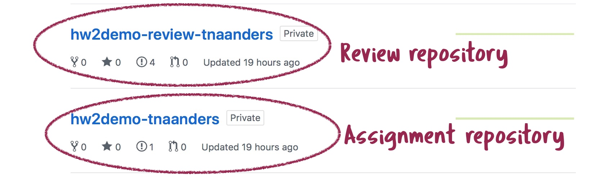

Welcome to Peer review 101, Summer 2019! This course uses GitHub as a platform to submit your assignments and to give/receive feedback from your peers. Please read the instructions below.

## Before the start of the assignment
### Create GitHub account
If you do not have one already, please create a free [GitHub account](https://github.com).

### Provide GitHub username
Please enter your GitHub username to the list provided by your instructor.

### Accept invitation to class organization
Your instructor will add you to the `ghclass-test` organization on Github. You will receive an invitation to join to the email address you specified when creating your GitHub account. Please accept the invitation to join the `ghclass-test` organization.

## Assignment
Your instructor will create a private repository on the `ghclass-test` organization and place the assignment files into this repository. The repository might be called something like `ghclass-test/hw1-username`.

To start the assignment, please complete the following steps:

1. Clone the assignment repository to a local repository by creating a new RStudio Version Control project
2. Complete the assignment
3. Commit and push your work to the remote assignment repository

<span style="color:#C70039">**Things to keep in mind**</span>

- <span style="color:#C70039">Save in repository:</span> Please save your work only in the assignment-specific repository created by the instructor. The files will automatically be moved to your peer reviewers once the assignment is complete. If you save files outside this repository, your work may not be submitted for review and grading.
- <span style="color:#C70039">Don't change file names:</span> Please do not change the names of files in your repository.

## Review
Once the assignment is complete, the review process begins. Your instructor will create a second repository for you, named something like `ghclass-test/hw1-review-username`.




The new repository contains folders for each of your peers' assignments you are asked to review. Each folder also contains a review form for you to fill out.


You instructor will open an issue in this new repository with a check list of tasks to complete. You will go through the following steps:

1. Clone the review repository to a local repository by creating a new RStudio Version Control project
2. Review and give comments on the assignment of each of your peers
3. Fill out review form
4. Commit and push your work to the remote review repository

### Review assignment
When reviewing your peers' work, please give them helpful comments and suggestions directly in their assignment file.

### Fill out review form
The review form is a RMarkdown (`.Rmd`) document. The review form contains review questions to answer for each of your classmates' assignments. On the top of the review form, you will find a so-called [YAML header](https://bookdown.org/yihui/rmarkdown/html-document.html). The review form contains `[INSERT SCORE]` placeholders in the `params` section of the YAML, for example called `q1_score` and `q2_score`. The YAML header might look like this:

```
---
title: "Reviewer feedback form"
output: github_document
params:
  q1_score: [INSERT SCORE]
  q2_score: [INSERT SCORE]
---
```

Please replace `[INSERT SCORE]` for each of the `q*_score` parameters with the number of points you give the author for each question. A completed YAML header should look like this:
```
---
title: "Reviewer feedback form"
output: github_document
params:
  q1_score: 3
  q2_score: 1
---
```

## Engage with feedback
When review process is complete, your instructor will pass your peers' feedback back to your assignment repository. Each reviewer's feedback will be saved in a separate folder, for example called `rev1` for reviewer 1's feeback, `rev2` for reviewer 2's feedback, and so on.


To finish the assignment, please complete the following steps:

1. Pull the changes from your remote assignment repository into the local copy of your assignment repository
2. Review the changes the reviewer made directly in your assignment
3. Fill out the rating form for the feedback you received from your peers
4. Commit and push your work to the remote assigment repository

You instructor will open an issue in your assignment repository with a check list of tasks to complete.

### Fill out rating form
The reviewer folders that are created on your assignment repository contain a RMarkdown document with a short questionnaire asking you to rate the feedback you received from your peers. Please enter your score for each category in the YAML header of the form, replacing the `NA`s. A completed form might look like this.
```
---
title: "Author feedback form"
output: github_document
params:
  helpfulness: 3
  accuracy: 2
  fairness: 4
---
```


