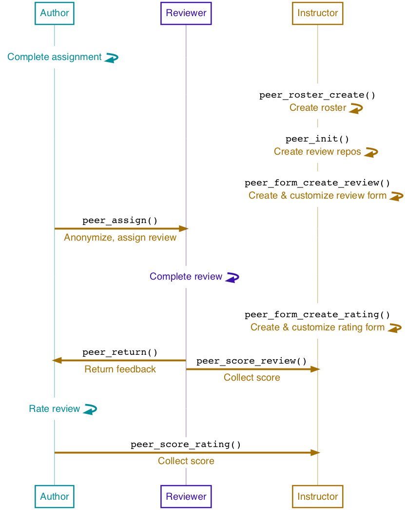

<style type="text/css">

h1.title {
  font-size: 38px;
  color: #581845;
}
h1 { /* Header 1 */
  font-size: 26px;
  color: #581845;
}
h2 { /* Header 2 */
    font-size: 20px;
  color: #900C3F;
}
h3 { /* Header 3 */
  font-size: 14px;
  color: #C70039;
}
</style>

```{r setup, include = FALSE}
knitr::opts_chunk$set(
  collapse = TRUE,
  comment = "#>"
)
```

This vignette introduces the peer review functionality of `ghclass` and provides a step-by-step guide. For more information on the pedagogy of peer review in undergraduate courses, see the draft of the [accompanying paper](https://github.com/thereseanders/cprpaper/blob/master/cetinkayarundelanders_cpr.pdf) by the package authors.

# Before peer review
The peer review process is initiated after a regular assignment has been distributed to students. Below, we run through a quick example of how to set up a fictional assignment "hw2" for four students using the `create_repo()` function. For a more detailed description of how to set up student repositories in a GitHub Organization,  see the `ghclass` vignette.
```{r, eval = F}
library(ghclass)

# 1. Set up vector of student user names, HW identifier prefix, and organization name
user = c("anya", "bruno", "cecile", "diego")
prefix = "hw2-"
org = "ghclass-demo"


# 2. Create student- and assignment-specific repositories
repo_create(org, user, prefix = prefix)

# 3. Add students to their individual repos
repo_add_user(glue::glue("{org}/{prefix}{user}"), user)

# 4. Place homework files in repositories
task <- "/Users/thereseanders/Documents/RStudio/introggplot2/hw2/hw2_task.Rmd"
data <- "/Users/thereseanders/Documents/RStudio/introggplot2/hw2/iris_data.csv"
repo_add_file(org_repos(org, filter = prefix),
              file = c(task, data),
              message = "Adding task and data for homework 2.")
```

# Step-by-step guide to peer review
The peer review process with `ghclass` has three stages.

1. **Initiation**: Create an assignment-specific roster and review repos for all students.
2. **Assign review**: Create and customize review forms, distribute review forms and authors' assignments to reviewers, students complete review.
3. **Return review & rating**: Create rating form, return review to authors, optional: students rate reviews.

```{r, out.width = "500px", echo = FALSE}

```


## Initiation

### Create a roster of author-reviewer assignments
The `peer_create_roster()` function generates data frame of random author-reviewer assignments. The parameter `n_rev` specifies the number of reviewers per assignment. Instructors should choose the number of reviewers per assignment carefully, as each additional review will significantly increase the time investment for students and the calls that have to be made to the API in the review process.

The function automatically randomizes the order in which students are assigned to review their peers' work. A seed is set to make the assignment of authors to reviewers reproducible. If the function default of `write_csv = TRUE` is selected, the function writes the roster to a .csv file. We recommend for instructors to set `write_csv = TRUE` and the seed that was used to create the roster is automatically incorporated into the file name of the output. This ensures reproducibility of the random assignment.

The roster file should be read as follows. 

- `user` lists students' GitHub user names
- `user_random` randomizes the order of user names and gives each user an anonymous ID, in the pattern `aut*`.
- The `rev*` column(s) specify the randomized user ID of the student(s) that are assigned to review the user's assignment.

We recommend for instructors to create a new roster file (with a new random seed) for each assignment to prevent the same pairings of students reviewing each others work over and over throughout the course. For the purpose of demonstration, below we save the roster in a data frame called `roster_test`.
```{r, eval = F}
roster_test = peer_create_roster(2, user, write_csv = F, seed = 678)
roster_test
```

### Create review repositories
The `peer_init()` function initiates peer review repositories for each user. This is done to ensure that authors' assignments do not permanently live on the repositories in which reviewers created their assignment. `peer_init()` creates a review repository for each user, adds users to the respective repositories, and applies peer review labels to all repositories (i.e. assignment and review repositories). The repositories are identified via the tag "-review" being automatically added to the instructor-specified `prefix` or `suffix` parameters.
```{r, eval = F}
peer_init(org = org,
          roster = roster_test,
          prefix = prefix)
```

## Assign review

### Create and customize feedback form for reviewers
Instructors can use the `peer_create_form_review()` function to create a blank feedback form and save it as an RMarkdown (`.Rmd`) file. Instructors can specify the number of questions to be included in the blank form. The function automatically creates `q*_score` parameters for each question in the YAML header of the RMarkdown document. Students are extracted to use these `q*_score` fields in the YAML to record the scores they give authors for their assignement. These YAML parameters are later used to extract and save student scores. 

By default, the files contain an `author` field in the YAML header to prompt reviewers to identify themselves. Keeping reviewers non-anonymous (as opposed to authors) is likely to discourage overly harsh or rude reviews. If reviewers should instead stay anonymous, setting `double_blind = TRUE` will remove this field.
```{r, eval = F}
peer_create_form_review(2,
                        double_blind = double_blind,
                        fname = "feedback_blank_review")
```
The blank form is saved in the working directory, unless otherwise specified. The instructor will then customize the questions to be answered by reviewers. 

### Distribute feedback forms to reviewers
The `peer_add_file_rev()` function is used to place the customized review forms into reviewers' repositories, based on the review roster. The feedback forms are saved author-specific folders, identified with each author's anonymous author ID contained in the `user_random` column of the roster.
```{r, eval = F}
peer_add_file_rev(
        org = org,
        roster = roster_test,
        prefix = prefix,
        local_path = "/Users/thereseanders/Documents/RStudio/introggplot2/hw2/hw2_review.Rmd")
```

### Move author files to reviewers
The `peer_assign()` function distributes review assignment to reviewers. It grabs designated files on the authors' repositories and clones them into the author-specific folder on reviewers' repositories, based on the roster. `peer_assign()` will open an issue in the reviewers' repositories that contains links to the relevant review files.

If no `path` is specified within `peer_assign()`, all files on authors' repositories will be moved to their folder on the review repositories. Specifying the name of the review feedback form via the `form_review` parameter leads the issue that is created in the process to contain a link to this form. 
```{r, eval = F}
peer_assign(
  org = org,
  roster = roster_test,
  prefix = prefix,
  form_review = "hw2_review.Rmd"
)
```

To ensure that the process of moving files from authors' to reviewers' repositores runs smoothly and author anonymity is maintained, students should be asked to not change file names and to not add identifying information such as name, student ID, or email addresses to their assignments.

## Return review & rating

### Collect scores given by reviewers
`peer_score_review()` collects the scores given by reviewers to authors. We recommend keeping the default setting of `write_csv = TRUE` to save the output as a `.csv` file in the working directory.
```{r, eval = F}
peer_score_review(
  org = org,
  roster = roster_test,
  prefix = prefix,
  form_review = "hw2_review.Rmd",
  write_csv = TRUE
)
```

### [Recommended] Create rating form for authors
The `peer_create_form_rating()` can be used to create a blank RMarkdown form used to collect authors' feedback on the reviews. By default, three rating categories[^1] are included in the file:

1. `helpfulness`: The reviewer's feedback was constructive and helpful.
2. `accuracy`: The reviewer's assessment accurately describes the quality of my work.
3. `fairness`: The reviewer's assessment was fair.

[^1]: The rating categories are based on Reily, K. and P. Ludford Finnerty,  and L. Terveen (2009): Two Peers Are Better Than One: Aggregating Peer Reviews for Computing Assignments is Surprisingly Accurate. In *Proceedings of the ACM 2009 International Conference on Supporting Group Work*. GROUP’09, May 10–13, 2009, Sanibel Island, Florida, USA.

The rating categories can be adjusted via the `category` parameter. By default, the resulting `.Rmd` file is saved in the working directory. Customization of this form is possible, but not necessary.
```{r, eval = F}
peer_create_form_rating(fname = "hw2_rating", 
                        category = c("accuracy", "fairness"))
```

### Double blind vs. single blind review
The `double_blind` parameter is used to determine whether authors know who reviewed their assignments (`double_blind = FALSE`), or whether the entire review process is anonymous (`double_blind = TRUE`). The default is for authors to know who reviewed their assignments. Keeping reviewers non-anonymous is likely to discourage overly harsh or rude reviews. Authors will always remain anonymous to reviewers.

This parameter should be set once for each assignment and then passed to each of the functions in the return review process. `double_blind` determines the naming of folders on authors repositories. Changing from a setting of double blind to single blind review, or vice versa, in the middle of the return review process will prevent `peer_add_file_aut()`, `peer_return()` and `peer_score_rating()` to locate the correct files on reviewers' and authors' repositories.
```{r, eval = F}
double_blind = TRUE
```


### [Recommended] Distribute author rating forms
If instructors wish to ask authors for a rating of the reviews, they may use the `peer_add_file_aut` to create reviewer-specific folders on author repositories and place the rating form into these repositories. If `double_blind = TRUE`, folder names will be based on reviewers' user names. If `double_blind = FALSE`, folder names will be based on the random reviewer IDs contained in the roster. 
```{r, eval = F}
peer_add_file_aut(
        org = org,
        roster = roster_test,
        prefix = prefix,
        local_path = "/Users/thereseanders/Documents/RStudio/introggplot2/hw2/hw2_rating.Rmd",
        double_blind = double_blind
)
```


### Move reviewer feedback to author repositories
`peer_return()` implements the following steps:

1. places authors' original file in reviewer-specific folders on authors' repositories
2. clones reviewers' feedback and corrections into reviewer-specific folders on authors' repositories
3. opens an issue on authors' repositories with links to the commit illustrating the difference between their assignment and reviewers' corrections, the review form with reviewers' feedback and, if applicable, the rating form to be completed by authors.

Students will receive an email to the address registered for their GitHub user name alerting them that a new issue has been created in their repository.

Only select files will be moved and saved in reviewer-specific folders on authors' repositories and should be specified by the instructor via the `path` parameter. Please not that the `peer_return()` function is relatively costly in terms of calls to the API. Instructors are advised to select only the most relevant files in this step, for example the review feedback form and comments made by the reviewer on authors' original files.
```{r, eval = F}
peer_return(
  org = org,
  roster = roster_test,
  prefix = prefix,
  path = c("hw2_task.Rmd"),
  form_review = "hw2_review.Rmd",
  form_rating = "hw2_rating.Rmd",
  double_blind = double_blind
)
```

### [Recommended] Collect scores given by authors
We use `peer_score_rating()` to collect the ratings given by authors on reviewers' feedback. We recommend keeping the default setting of `write_csv = TRUE` to save the output as a `.csv` file.
```{r, eval = F}
peer_score_rating(
  org = org,
  roster = roster_test,
  prefix = prefix,
  form_rating = "hw2_rating.Rmd",
  double_blind = double_blind
)
```


## Issues and recommendations
Peer review is great! It gives students a chance to learn from each other, get meaningful feedback on their assignment, and it reduces the overhead of grading in large classes. However, asking students to review each others' work also increases their workload. Thus, instructors should carefully consider

1. the amount of peer-reviewed homework assignments in each course,
2. the number of reviewers per assignment, and
3. the timing of deadlines for the assignment and reviews.

### Number of homework assignments
Writing a meaningful review with constructive comments is a learning process and it takes time! Thus, when implementing peer review in a course, instructors should consider reducing either the number or the scope of assignments to give students sufficient time to complete and engage with reviews. 

### Number of reviewers
On one hand, more reviewers means more feedback and less weight to outlier reviews for grading, so more is better, right? On the other hand, more reviewers also means more student hours spent on giving feedback and not working on their final projects, learning new skills, or recharging. Plus, how much different will the feedback from each additional reviewer be after two or three reviews? Thus, we recommend to assign a maximum of two or three reviewers per assignment to balance the benefits of having multiple reviews and the demand on students' time/diminishing returns.

### Timing
Instructors should carefully consider the timing of deadlines for a) the assignment, b) the completion of the review, and c) the completion of the author rating of reviewers' feedback, if applicable. 

Suppose you wanted to give students the weekend to complete assignments, your class meets once a week, and you have one homework assignment per week. As shown in the table below, the review process for an assignment given in week 1 won't be completed until three weeks later. Instructors should also keep in mind that based on this  timeline, starting in week 3, students will juggle parts of the assignments from weeks 1, 2, and 3 (in three separate repositories).

| Week | Assignment | Completed  |
|:----:|------------|------------|
| 1    | a) Homework (HW) 1                                    |                                                       |
| 2    | a) Review of HW 1 <br>b) HW 2                             | a) HW 1                                                   |
| 3    | a) Rating of review on HW 1 <br>b) Review of HW 2 <br>c) HW 3 | a) Review of HW 1 <br>b) HW 2                             |
| 4    | ...                                                   | a) Rating of review on HW 1 <br>b) Review of HW 2 <br>c) HW 3 |
| ...  | ...                                                   | ...                                                   |

### API rate limits
The GitHub API that is used to access information on students' repositories has [maximum hourly rate limits](https://developer.github.com/apps/building-github-apps/understanding-rate-limits-for-github-apps/). The baseline limit is 5,000 calls to the API per hour. With two reviewers per assignment and 2 files to be moved when returning the review, this hourly limit is reached by `peer_return()` with 166 students. 
